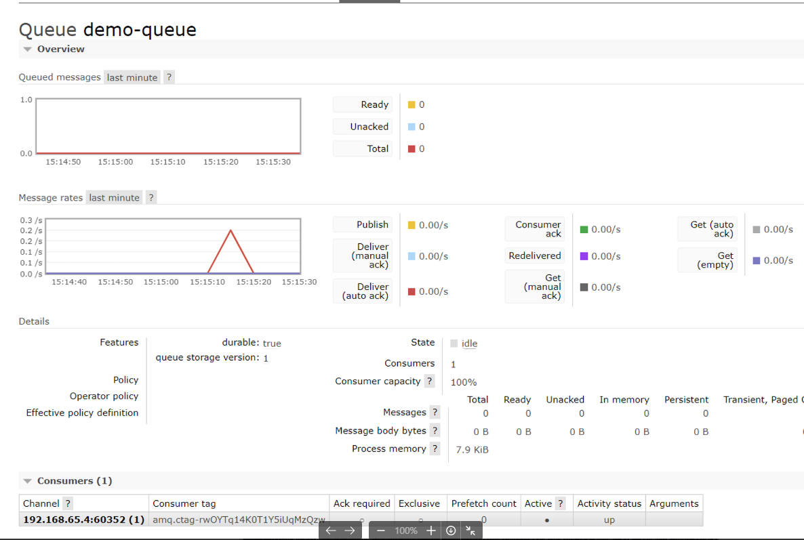
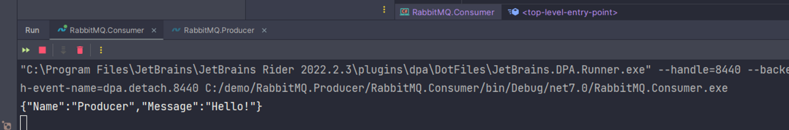

# RabbitMQPOC

## Description

- Calculator: RabbitMQ consumer + MassTransit
- PayRun: RabbitMQ producer + MassTransit
- Models: Shared models
- RabbitMQ.Consumer: A basic RabbitMQ consumer
- RabbitMQ.Producer: A basic RabbitMQ producer
- RabbitMQ.MassTransit: A basic MassTransit POC

## Tech Stack

- .NET Core 7.0
- RabbitMQ
- MassTransit
- Docker

MassTransit is a free, open-source, distributed application framework for .NET applications. It abstracts away the
underlying logic required to work with message brokers, such as RabbitMQ, making it easier to create message-based,
loosely coupled applications.

## How to run

### Installing RabbitMQ

```bash
$ docker run -d --hostname my-rabbit --name ecomm-rabbit -p 15672:15672 -p 5672:5672 rabbitmq:3-management
```

We are using the `rabbitmq:3-management` image from DockerHub which will provide us with a UI, available on port 15672.
We must also add a port mapping for 5672, which is the default port RabbitMQ uses for communication. In order for us to
access the management UI, we open a browser window and navigate to `localhost:15672`, using the default login of
guest/guest. We will come back to this management UI later to see what MassTransit creates for us in RabbitMQ.

## Dependencies

- MassTransit.AspNetCore
- MassTransit.RabbitMQ
- RabbitMQ.Client
- RabbitMQ.Client.Core.DependencyInjection

## Screenshots


